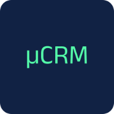

<p align="center">
   
</p>

# MicroCRM (P7 - Développeur Full-Stack - Java et Angular - Mettez en œuvre l'intégration et le déploiement continu d'une application Full-Stack)

MicroCRM est une application de démonstration basique ayant pour objectif de servir de socle pour le module "P7 - Développeur Full-Stack".

L'application MicroCRM est une implémentation simplifiée d'un ["CRM" (Customer Relationship Management)](https://fr.wikipedia.org/wiki/Gestion_de_la_relation_client). Les fonctionnalités sont limitées à la création, édition et la visualisations des individus liés à des organisations.


---

## Livrables mission P7 (soutenance)

### Repo GitHub

| Livrable | Emplacement |
|----------|-------------|
| **Workflow CI/CD** | [.github/workflows/ci-cd.yml](.github/workflows/ci-cd.yml) |
| **Dockerfile(s)** | [Dockerfile](Dockerfile) à la racine (multi-cibles : `front`, `back`, `standalone`) |
| **README** | Ce fichier : choix techniques et instructions d'exécution |

### Documentation de CI/CD complète (mission)

La mission demande « *Une documentation de CI/CD complète contenant* » les 8 éléments ci-dessous. **Un seul fichier** les regroupe : **[docs/DOCUMENTATION-CICD-LIVRABLE.md](docs/DOCUMENTATION-CICD-LIVRABLE.md)**

| Partie 1 | Partie 2 |
|----------|----------|
| § 1 Les étapes de mise en œuvre CI/CD | § 4 Les KPI proposés et les métriques |
| § 2 Le plan de conteneurisation et déploiement | § 5 L'analyse des métriques |
| § 3 Le plan de testing périodique | § 6 Le plan de sécurité |
| | § 7 Le plan de sauvegarde des données |
| | § 8 Le plan des mises à jour |

### Autres documents du livrable

| Document | Contenu |
|----------|---------|
| [docs/PRESENTATION-SOUTENANCE-P7.md](docs/PRESENTATION-SOUTENANCE-P7.md) | Partie 1 (étapes de mise en œuvre CI/CD, plan de conteneurisation et déploiement, plan de testing périodique). **Document principal = DOCUMENTATION-CICD-LIVRABLE.md (tableau ci-dessus).** Partie 2 (KPI et métriques, analyse des métriques, plan de sécurité, plan de sauvegarde des données, plan des mises à jour). Voir tableau ci-dessus à l’évaluateur. |
| [docs/VERIFICATION-AUTO-EVALUATION-P7.md](docs/VERIFICATION-AUTO-EVALUATION-P7.md) | Grille de vérification alignée sur la fiche d’auto-évaluation (FAE) . |

### Documents de support (détails par thème)

| Document | Thème |
|----------|--------|
| [docs/PLANS-CICD.md](docs/PLANS-CICD.md) | Plan de testing périodique, plan de sécurité (CI), principes de conteneurisation et déploiement. |
| [docs/PLAN-SECURITE-FINAL.md](docs/PLAN-SECURITE-FINAL.md) | Vulnérabilités, règles critiques, couverture, recommandations sécurité. |
| [docs/PLANS-DEPLOIEMENT-SAUVEGARDE-MISE-A-JOUR.md](docs/PLANS-DEPLOIEMENT-SAUVEGARDE-MISE-A-JOUR.md) | Plan de déploiement, plan de sauvegarde des données, plan des mises à jour. |
| [docs/METRIQUES-DORA-KPI.md](docs/METRIQUES-DORA-KPI.md) | Métriques DORA, KPI opérationnels, méthode de calcul et analyse. |
| [docs/DOCUMENTATION-TECHNIQUE-FINALE.md](docs/DOCUMENTATION-TECHNIQUE-FINALE.md) | Synthèse métriques, KPI, résultats SonarQube, observations logs/dashboards, recommandations (analyse des métriques). |
| [docs/DOCKER-COMPOSE.md](docs/DOCKER-COMPOSE.md) | Orchestration des services, commandes docker-compose. |
| [docs/ELK.md](docs/ELK.md) | Stack ELK (monitoring), centralisation des logs, Kibana. |

---

## Choix techniques (CI/CD et conteneurisation)

- **Pipeline** : GitHub Actions (`.github/workflows/ci-cd.yml`) — CI sur chaque push/PR (build back + front, tests JUnit et Karma), analyse SonarCloud si activée, CD sur `main`/`master` (build et push des images Docker vers Docker Hub).
- **Conteneurisation** : un seul Dockerfile multi-étapes (Alpine) — cibles `front` (Caddy), `back` (JRE 17), `standalone` (Supervisord) pour limiter la taille et la surface d’attaque.
- **Qualité** : tests automatiques (back + front) et SonarQube Cloud (qualité, sécurité, couverture) ; secrets et variables via GitHub (aucun secret en clair).
- **Registre** : publication des images sur Docker Hub (config : `DOCKERHUB_TOKEN`, `DOCKERHUB_USERNAME`).

---

## Code source

### Organisation

Ce [monorepo](https://en.wikipedia.org/wiki/Monorepo) contient les 2 composantes du projet "MicroCRM":

- La partie serveur (ou "backend"), en Java SpringBoot 3;
- La partie cliente (ou "frontend"), en Angular 17.

### Démarrer avec les sources

#### Serveur

##### Dépendances

- [OpenJDK >= 17](https://openjdk.org/)

##### Procédure

1. Se positionner dans le répertoire `back` avec une invite de commande:

   ```shell
   cd back
   ```

2. Construire le JAR:

   ```shell
   # Sur Linux
   ./gradlew build

   # Sur Windows
   gradlew.bat build
   ```

3. Démarrer le service:

   ```shell
   java -jar build/libs/microcrm-0.0.1-SNAPSHOT.jar
   ```

Puis ouvrir l'URL http://localhost:8080 dans votre navigateur.

#### Client

##### Dépendances

- [NPM >= 10.2.4](https://www.npmjs.com/)

##### Procédure

1. Se positionner dans le répertoire `front` avec une invite de commande:

   ```shell
   cd front
   ```

2. (La première fois seulement) Installer les dépendances NodeJS:

   ```shell
   npm install
   ```

3. Démarrer le service de développement:

   ```shell
   npx @angular/cli serve
   ```

Puis ouvrir l'URL http://localhost:4200 dans votre navigateur.

### Exécution des tests

#### Client

**Dépendances**

- Google Chrome ou Chromium

Dans votre terminal:

```shell
cd front
CHROME_BIN=</path/to/google/chrome> npm test
```

#### Serveur

Dans votre terminal:

```shell
cd back
./gradlew test
```

### Images Docker

#### Client

##### Construire l'image

```shell
docker build --target front -t orion-microcrm-front:latest .
```

##### Exécuter l'image

```shell
docker run -it --rm -p 80:80 -p 443:443 orion-microcrm-front:latest
```

L'application sera disponible sur https://localhost.

#### Serveur

##### Construire l'image

```shell
docker build --target back -t orion-microcrm-back:latest .
```

##### Exécuter l'image

```shell
docker run -it --rm -p 8080:8080 orion-microcrm-back:latest
```

L'API sera disponible sur http://localhost:8080.

#### Tout en un

```shell
docker build --target standalone -t orion-microcrm-standalone:latest .
```

##### Exécuter l'image

```shell
docker run -it --rm -p 8080:8080 -p 80:80 -p 443:443 orion-microcrm-standalone:latest
```

L'application sera disponible sur https://localhost et l'API sur http://localhost:8080.

---

## Documentation (mission P7)

- **[Documentation CI/CD complète (livrable soutenance)](docs/DOCUMENTATION-CICD-LIVRABLE.md)** : Partie 1 (étapes CI/CD, conteneurisation, testing) et Partie 2 (KPI, métriques, sécurité, sauvegarde, mises à jour) ; inclut la référence des commandes.
- **[Plans CI/CD](docs/PLANS-CICD.md)** : plan de testing, plan de sécurité, principes de conteneurisation et déploiement.
- **[Docker Compose](docs/DOCKER-COMPOSE.md)** : orchestration des services, lancement avec `docker-compose up`.
- **[Stack ELK](docs/ELK.md)** : centralisation des logs (Elasticsearch, Logstash, Kibana), dashboards.
- **[Métriques DORA et KPI](docs/METRIQUES-DORA-KPI.md)** : indicateurs de performance du pipeline et analyse.
- **[Plan de sécurité (finalisé)](docs/PLAN-SECURITE-FINAL.md)** : vulnérabilités, SonarQube, recommandations.
- **[Plans déploiement, sauvegarde, mise à jour](docs/PLANS-DEPLOIEMENT-SAUVEGARDE-MISE-A-JOUR.md)** : procédures et bonnes pratiques.
- **[Documentation technique finale](docs/DOCUMENTATION-TECHNIQUE-FINALE.md)** : synthèse métriques, KPI, recommandations.
- **[Vérification auto-évaluation P7](docs/VERIFICATION-AUTO-EVALUATION-P7.md)** : grille de vérification par rapport au livrable attendu.

---

## CI/CD (GitHub Actions)

Le pipeline est défini dans [.github/workflows/ci-cd.yml](.github/workflows/ci-cd.yml) :

- **CI** : à chaque push et pull request → build back + front, exécution des tests (JUnit, Karma).
- **SonarQube Cloud** : activé si la variable de dépôt `ACTIVATE_SONAR` est définie à `true`. À configurer :
  - **Secrets** : `SONAR_TOKEN` (jeton SonarCloud).
  - **Variables de dépôt** : `SONAR_PROJECT_KEY`, `SONAR_ORGANIZATION` (nom d’organisation SonarCloud).
- **CD** : sur push vers `main` / `master` → build et publication des images Docker (front, back, standalone) vers Docker Hub. Configurer le secret `DOCKERHUB_TOKEN` et (optionnel) la variable `DOCKERHUB_USERNAME`.

Aucun secret ne doit être stocké en clair ; utiliser les [secrets et variables GitHub](https://docs.github.com/en/actions/security-guides/encrypted-secrets).

---

## Docker Compose

Lancer l’application avec les services orchestrés :

```shell
docker-compose up --build
```

- **Front** : http://localhost (80) ou https://localhost (443).
- **Back** : http://localhost:8080.

Image tout-en-un (front + back dans un seul conteneur) :

```shell
docker-compose --profile full up standalone --build
```

Voir [docs/DOCKER-COMPOSE.md](docs/DOCKER-COMPOSE.md) pour les détails.

---

## Lancer MicroCRM + ELK ensemble

Pour démarrer **l'application et la stack ELK** (Elasticsearch, Logstash, Kibana) en une seule commande, avec les logs du back-end centralisés dans Kibana :

### Prérequis

- Docker et Docker Compose installés.
- Environ **4 Go RAM** disponibles pour la stack ELK.

### Commande de lancement

```shell
docker-compose -f docker-compose.with-elk.yml up --build -d
```

### URLs des services

| Service | URL |
|---------|-----|
| **Application (front)** | http://localhost |
| **API (back)** | http://localhost:8080 |
| **Kibana** | http://localhost:5601 |
| **Elasticsearch** | http://localhost:9200 |

### Configurer Kibana pour voir les logs

1. Ouvrir **http://localhost:5601** (attendre 1–2 min si Kibana démarre).
2. Menu **☰** → **Stack Management** → **Data Views** → **Create data view**.
3. **Name** : `MicroCRM Logs` | **Index pattern** : `microcrm-logs-*` | **Timestamp field** : `@timestamp` → **Save**.
4. Menu **☰** → **Discover** → sélectionner la data view **MicroCRM Logs**.
5. Utiliser l'application (http://localhost) pour générer des logs, puis rafraîchir Discover.

### Arrêter et relancer

```shell
# Tout arrêter
docker-compose -f docker-compose.with-elk.yml down

# Relancer (sans rebuild)
docker-compose -f docker-compose.with-elk.yml up -d
```

### Fichiers concernés

- `docker-compose.with-elk.yml` : app (back, front) + ELK. Le back envoie ses logs à Logstash via le profil Spring `elk`.
- `elk/logstash/pipeline/logstash.conf` : pipeline Logstash (réception logs TCP → Elasticsearch).

<details>
<summary>Option : ELK seul (sans application)</summary>

```shell
docker-compose -f docker-compose-elk.yml up -d
```

</details>

Voir [docs/ELK.md](docs/ELK.md) pour plus de détails.


