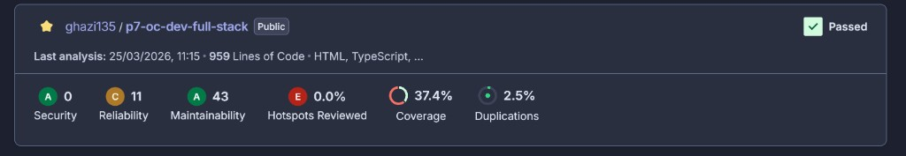
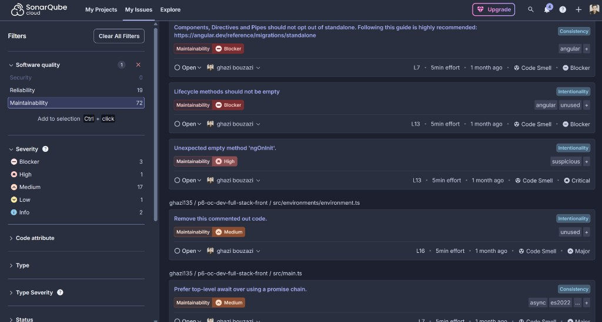
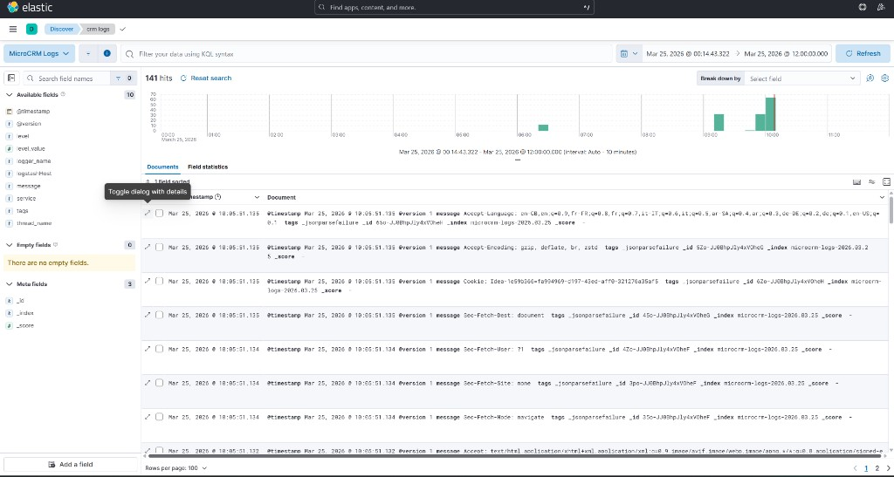

# Documentation technique – MicroCRM (P7)

**Structure :** ce document suit le **template de documentation technique P7 Full-Stack** fourni par OpenClassrooms (fichier *Template documentation P7 FS*, titres et ordre des parties : Introduction → pipeline → conteneurisation → tests → sécurité → monitoring/KPI → sauvegarde → mises à jour → conclusion). Il couvre la mission « Mettre en œuvre l’intégration et le déploiement continu d’une application Full-Stack » (documentation CI/CD complète).

---

## Page de titre

| Champ | Contenu |
|--------|---------|
| **Titre du document** | Documentation technique – MicroCRM (CI/CD) |
| **Auteur** | *GHAZI BOUZAZI* |
| **Option choisie** | **Option B** – Scénario fictif Orion |
| **Date** | *21/03/2026* |

**Compléments de soutenance :** [PRESENTATION-SOUTENANCE-P7.md](PRESENTATION-SOUTENANCE-P7.md), [VERIFICATION-AUTO-EVALUATION-P7.md](VERIFICATION-AUTO-EVALUATION-P7.md).

### Correspondance mission / sections

| Exigence (brief) | Section dans ce document |
|------------------|---------------------------|
| Étapes de mise en œuvre CI/CD | **§ 2** |
| Plan de conteneurisation et déploiement | **§ 3** |
| Plan de testing périodique | **§ 4** |
| Plan de sécurité | **§ 5** |
| KPI, métriques DORA, analyse | **§ 6** |
| Plan de sauvegarde | **§ 7** |
| Plan des mises à jour | **§ 8** |

---

## 1. Introduction

### 1.1 Contexte du projet

Application **MicroCRM** full-stack : backend **Spring Boot / Java 17 / Gradle**, frontend **Angular**. Le dépôt est sur **GitHub** ; l’industrialisation repose sur **GitHub Actions**, **Docker**, **SonarQube Cloud** (optionnel) et, pour le scénario Orion, une stack **ELK** documentée dans le README pour l’observabilité.

### 1.2 Objectifs de l’industrialisation

- Automatiser **build**, **tests** et **analyse qualité** à chaque changement sur les branches protégées.
- Produire des **images Docker** reproductibles et les publier sur un registre (**Docker Hub**).
- Documenter **sécurité**, **sauvegarde**, **mises à jour** et **indicateurs** pour la mise en production et l’amélioration continue.

### 1.3 Technologies principales

| Domaine | Outils |
|---------|--------|
| CI/CD | GitHub Actions (`actions/checkout`, `setup-java`, `setup-node`, `docker/build-push-action`, SonarSource scan, `softprops/action-gh-release`) |
| Conteneurs | Dockerfile multi-cibles, Docker Compose |
| Qualité | SonarQube Cloud, JaCoCo (back), LCOV (front) |
| Tests | JUnit 5 / Spring Test (back), Karma / Jasmine (front) |

### 1.4 Présentation rapide du pipeline CI/CD

Le workflow **`.github/workflows/ci-cd.yml`** enchaîne : jobs **backend** et **frontend** (build + tests en parallèle) → **SonarQube Cloud** (si `ACTIVATE_SONAR=true`) → sur **push** vers `main` ou `master` uniquement : **build & push** des images Docker puis **release GitHub** (tag dérivé de `back/build.gradle`, JAR + archive front). Les **pull requests** vers `main`/`master` exécutent la CI (et Sonar si activé) mais **pas** le CD ni la release.

---

## 2. Étapes de mise en œuvre du pipeline CI/CD

### 2.1 Structure du pipeline

| Ordre | Job (nom dans Actions) | Rôle | Outils / actions notables |
|-------|------------------------|------|-----------------------------|
| 1 (parallèle) | Backend – Build & Tests | Checkout, Gradle build + tests, artefact JAR | `actions/checkout@v4`, `setup-java@v4` (cache Gradle), `./gradlew build` |
| 1 (parallèle) | Frontend – Build & Tests | Checkout, `npm ci`, build prod, tests Karma | `setup-node@v4` (cache npm), Chrome headless, `npm test -- --no-watch --browsers=ChromeHeadlessNoSandbox` |
| 2 | SonarQube Cloud | Rebuild avec rapports de couverture, scan | `SonarSource/sonarqube-scan-action@v6` ; modules `back` + `front` |
| 3 | Build & Push Docker images | Images `front`, `back`, `standalone` | `docker/setup-buildx-action@v3`, `docker/login-action@v3`, `docker/build-push-action@v6` |
| 4 | Create Release | Tag `v*` + assets `microcrm.jar`, `front-dist.zip` | `softprops/action-gh-release@v2` |

**Déclencheurs réels :** `push` et `pull_request` **uniquement** pour les branches **`main`** et **`master`**. Une push sur une autre branche **ne** lance **pas** le workflow.

**Justification des actions GitHub :** actions officielles ou maintenues (Docker, Sonar) pour limiter la dette de maintenance ; cache Gradle/npm pour le **Lead Time** ; Buildx + cache GHA pour accélérer les builds d’images ; release automatisée pour tracer les livrables binaires alignés sur la version Gradle.

### 2.2 Scripts d’automatisation

| Élément | Rôle | Exécution / adaptation |
|---------|------|-------------------------|
| **`.github/workflows/ci-cd.yml`** | Orchestration complète CI/CD | Se déclenche sur GitHub ; modifier les jobs ou `env` pour adapter versions Java/Node, noms d’images, conditions `if`. |
| **`back/gradlew` + `build.gradle`** | Build et tests backend | Local : `cd back && ./gradlew build` ; couverture Sonar : `jacocoTestReport`. |
| **`front/package.json`** | Scripts `build`, `test` | Local : `cd front && npm ci && npm run build` ; tests CI : `npm test -- --no-watch --browsers=ChromeHeadlessNoSandbox`. |
| **Dockerfile (racine)** | Construction des images | `docker build --target front|back|standalone .` ; tags poussés par le workflow. |

Le workflow utilise des **steps** `run:` (shell) plutôt que des scripts `.sh` versionnés séparément : tout est lisible dans le YAML pour la reprise en main.

### 2.3 Reproductibilité

- **Relancer le pipeline :** pousser un commit ou ouvrir/mettre à jour une PR vers `main` ou `master` ; onglet **Actions** du dépôt pour consulter les runs.
- **Secrets (ne jamais commiter ni afficher) :** `DOCKERHUB_TOKEN`, `SONAR_TOKEN` ; le workflow utilise `secrets.*` et `vars.*` (ex. `DOCKERHUB_USERNAME`, `SONAR_PROJECT_KEY`, `SONAR_ORGANIZATION`, `ACTIVATE_SONAR`, `SONAR_HOST_URL` optionnelle).
- **SonarQube :** le job `sonarcloud` est en `continue-on-error: true` pour ne pas bloquer la CI en cas d’indisponibilité ou de configuration incomplète — à retirer si vous imposez un gate strict.

### 2.4 Secrets et variables (référence)

| Type | Nom | Usage |
|------|-----|--------|
| Secret | `DOCKERHUB_TOKEN` | Push des images |
| Secret | `SONAR_TOKEN` | Analyse SonarCloud |
| Variable | `DOCKERHUB_USERNAME` | Compte Docker Hub (sinon `repository_owner`) |
| Variable | `SONAR_PROJECT_KEY`, `SONAR_ORGANIZATION` | Projet SonarCloud |
| Variable | `ACTIVATE_SONAR` | `true` pour activer le job Sonar |
| Variable | `SONAR_HOST_URL` | Optionnel (défaut `https://sonarcloud.io`) |

---

## 3. Plan de conteneurisation et de déploiement

### 3.1 Dockerfiles

Le **Dockerfile** à la racine est un **build multi-étapes** avec cibles **`front`**, **`back`**, **`standalone`** :

| Cible | Idée | Ports |
|-------|------|-------|
| **front** | Build Angular → image légère (Alpine + Caddy) | 80, 443 |
| **back** | JAR Spring Boot + JRE 17 | 8080 |
| **standalone** | Front + back supervisés dans une seule image | 80, 443, 8080 |

**Choix :** images **Alpine** / bases officielles pour réduire taille et surface d’attaque ; **multi-stage** pour ne pas embarquer les toolchains de build en production ; configuration par **variables d’environnement** au déploiement, pas de secrets dans l’image.

### 3.2 docker-compose.yml

- Services **`back`** et **`front`** : lancement local avec `docker-compose up --build` (ports documentés dans le README).
- Profil **`full`** / service **standalone** : `docker-compose --profile full up standalone --build` selon la configuration du dépôt.

**Déploiement :** en CI/CD, publication sur **Docker Hub** avec tags `latest` et SHA ; en cible, `docker-compose pull && docker-compose up -d` (ou orchestrateur équivalent).

---

## 4. Plan de testing périodique

### 4.1 Types de tests automatisés

| Zone | Type | Outil | Couverture / qualité |
|------|------|--------|----------------------|
| Back | Unitaires / intégration Spring | JUnit 5, Spring Boot Test, DataJpaTest | JaCoCo → `back/build/reports/jacoco/test/jacocoTestReport.xml` |
| Front | Unitaires composants / services | Karma, Jasmine | LCOV → `front/coverage/microcrm/lcov.info` |
| Transverse | Analyse statique (sécurité, smells) | SonarQube Cloud | À la fin des jobs back/front (job dédié) |

**Critères de réussite :** échec d’un test ou du build **bloque** les jobs concernés ; le merge sur `main`/`master` ne doit pas introduire de régression détectée par la CI.

### 4.2 Fréquence d’exécution

| Événement | Tests exécutés |
|-----------|----------------|
| **Push** vers `main` ou `master` | Back + front (build + tests) ; puis Sonar si activé ; puis CD |
| **Pull request** vers `main` ou `master` | Back + front + Sonar si activé ; **sans** CD/release |
| **Autres branches** | Aucun run du workflow (tant que les déclencheurs ne sont pas étendus) |
| **Nightly / avant release** | *Optionnel :* ajouter un workflow `schedule` ou une règle manuelle ; non implémenté par défaut — les releases sur `main` passent déjà par la CI |

### 4.3 Objectifs des tests

- **Qualité** et **non-régression** avant merge et avant publication d’images.
- **Confiance au déploiement** : les mêmes commandes s’exécutent localement et sur le runner Ubuntu.

---

## 5. Plan de sécurité

### 5.1 Résultats SonarQube (à actualiser depuis SonarCloud)

| Catégorie | Ce qu’il faut y mettre | Où les lire |
|-----------|-------------------------|-------------|
| Vulnérabilités | **Security : A** ; **0** (aucune vulnérabilité bloquante remontée dans la synthèse) | SonarCloud → Security |
| Code smells critiques | **Maintainability : A** ; **43** issues (maintenabilité) ; **Hotspots reviewed : E, 0.0%** | Issues, filtres sévérité |
| Zones de complexité | **Cognitive Complexity : 18** (Back: 3, Front: 15) ; Cyclomatic Complexity : 91 | SonarCloud/SonarQube → Measures → Complexity |
| Couverture | **Coverage : 37.4%** (lignes/branches) | Lié aux rapports JaCoCo + LCOV |

Indicateurs complémentaires (capture SonarCloud) : **Reliability : C, 11** ; **Duplications : 2.5%**.

Captures SonarQube associées (preuves) :
`screenshots/sonarqube-metrics-2026-03-25.png` (métriques globales) et `screenshots/sonarqube-issues-2026-03-25.png` (issues).

### 5.2 Analyse des risques

| Risque | Origine possible | Mitigation dans le projet |
|--------|------------------|---------------------------|
| Fuite de secrets | Mauvaise config repo | Secrets GitHub uniquement ; pas de tokens dans le code |
| Dépendances vulnérables | npm / Gradle | SonarQube + pistes : `npm audit`, OWASP Dependency-Check |
| Image Docker obsolète | Bases non patchées | Mise à jour des tags de base documentée (§ 8) |
| Pipeline contourné | Merge sans CI | Protection de branche `main` côté GitHub (recommandé) |
| Qualité non bloquante | `continue-on-error` sur Sonar | À durcir si le Quality Gate doit être obligatoire |

### 5.3 Plan d’action / remédiation

| Horizon | Actions |
|---------|---------|
| **Immédiat** | Corriger vulnérabilités **blocker/critical** Sonar ; vérifier qu’aucun secret n’a été commité. |
| **Court terme** | Augmenter la couverture sur le code métier critique ; réduire duplications signalées. |
| **Long terme** | Audits dépendances en CI ; durcissement du gate Sonar ; revue périodique des images de base. |

Références utiles : [Règles SonarSource](https://rules.sonarsource.com/), [OWASP Top 10](https://owasp.org/Top10/).

---

## 6. Monitoring, métriques et KPI

### 6.1 Métriques DORA

| Métrique | Définition | Méthode de calcul (indicative) | Valeurs observées |
|----------|------------|--------------------------------|-------------------|
| **Lead Time for Changes** | Délai commit → prod utilisable | Horodatage merge `main` → fin du job CD + déploiement manuel éventuel | Moyenne ≈ `5,20 min` ; médiane ≈ `5,55 min` (3 runs `ci-cd.yml` success sur `master`, fenêtre `2026-03-23T05:35:21Z` → `2026-03-23T05:43:55Z`) |
| **Deployment Frequency** | Nombre de mises en prod sur une période | Compter les déploiements réels ou les pushes `main` avec CD réussi | `3` déploiements (runs workflow success `master`) sur la journée `23/03/2026` (UTC) |
| **MTTR** | Temps moyen de rétablissement après incident | Durée entre alerte / ticket et service rétabli | Non calculable sur la fenêtre : `0` incident `ERROR` détecté sur `microcrm-logs-*/@timestamp` entre `2026-03-23T05:35:21Z` et `2026-03-23T05:43:55Z` |
| **Change Failure Rate** | % de déploiements suivis d’un incident ou rollback | (Déploiements défaillants / déploiements totaux) × 100 | `0/3` = `0%` (aucun `ERROR` détecté sur la fenêtre observée, définition incident = présence d’au moins un log `level=ERROR`) |

Les durées des jobs **Backend – Build & Tests** et **Frontend – Build & Tests** dans l’onglet Actions servent de base concrète pour estimer le **Lead Time** côté pipeline.

### 6.2 KPI personnalisés

| KPI | Calcul / source | Objectif |
|-----|-----------------|----------|
| Temps de build back | Durée moyenne du job backend | Réduire (observé : ~38s sur le run `ci-cd.yml` fourni) |
| Temps de build front | Durée moyenne du job frontend | Réduire (observé : ~52s sur le run `ci-cd.yml` fourni) |
| **Temps d’exécution des tests** | Part du job consacrée aux steps `test` (back : Gradle test ; front : Karma) (observé : back 10.4s ; front 13s sur le run `ci-cd.yml` fourni) | Stabiliser et surveiller les régressions de perf |
| Taux de succès CI | Runs verts / runs totaux sur `main` | Viser 100 % |
| Erreurs dans les logs | Comptage niveau ERROR dans ELK / Kibana (`microcrm-logs-*`) | Détecter les pics (observé sur la fenêtre § 6.1 : 0) |

### 6.3 Analyse synthétique du monitoring

- **Tendances :** comparer sur 2–4 semaines les durées de workflow, le taux d’échec et le volume d’erreurs dans les logs.
- **Points forts :** parallélisation back/front, caches, images reproductibles.
- **Points à améliorer :** lenteurs résiduelles (tests front, build Docker), **couverture 37.4%** et **0.0% hotspots reviewed** ; dette Sonar à suivre via les issues.
- **Dashboards :** sous **Option B**, Kibana sur l’index des logs applicatifs — visualisations volumétrie, niveaux de log, recherche par corrélation (voir README et captures sous `docs/screenshots/` si présentes).
- **Alertes :** à définir dans la stack de monitoring (seuils sur taux d’erreur ou absence de logs) ; documenter ici les règles une fois configurées.

---

## 7. Plan de sauvegarde des données

### 7.1 Ce qui doit être sauvegardé

| Élément | Commentaire |
|---------|-------------|
| Données applicatives | Projet actuel : **HSQLDB en mémoire** — pas de persistance à sauvegarder tant qu’il n’y a pas de base dédiée. |
| Fichiers de configuration | Versionnés dans Git (`docker-compose*`, workflow, Logstash, etc.). |
| Artefacts de build | JAR et `front-dist.zip` via **GitHub Releases** ; images sur **Docker Hub** ; reproductibles depuis le code. |
| Secrets | Stockés côté GitHub ; maintenir une **liste à jour** (noms des clés) sans valeurs. |

### 7.2 Procédure de sauvegarde

| Aspect | Détail |
|--------|--------|
| **Format** | Git (historique) ; images OCI sur registre ; binaires en pièces jointes de release. |
| **Fréquence** | Continue pour le code (push) ; images à chaque CD réussi sur `main`/`master`. |
| **Outils** | `git push`, pipeline CI/CD, registre Docker. |

### 7.3 Procédure de restauration

| Scénario | Étapes |
|----------|--------|
| Perte d’un clone local | `git clone` / `git pull` depuis GitHub. |
| Perte d’images locales | `docker pull` depuis Docker Hub ou relancer le pipeline pour rebuild + push. |
| Environnement à reconstruire | Checkout du tag ou commit connu → `docker-compose up` ou déploiement depuis images taguées. |

**Limitation :** sans base persistante, pas de restauration de données métier ; une future BDD imposerait dumps planifiés et procédure de restore testée.

**Action automatisée facilitant la restauration :** le workflow reconstruit et republie les artefacts à partir du dépôt — pas besoin de sauvegardes manuelles du binaire si le code et le registre sont sains.

---

## 8. Plan de mise à jour

### 8.1 Mise à jour de l’application

- **Dépendances Gradle** (`back/build.gradle`) et **npm** (`front/package.json`) : mise à jour incrémentale, tests locaux + CI.
- **Frameworks** (Spring Boot, Angular) : suivre les guides de migration officiels.
- **Images Docker** : faire évoluer les tags de base dans le Dockerfile et `docker-compose-elk.yml` si utilisé ; rebuild et validation.

### 8.2 Mise à jour du pipeline CI/CD

- **Versions des actions** (`@v4`, `@v6`, etc.) : suivre les release notes GitHub Actions et Sonar ; mettre à jour le YAML après test sur une branche.
- **Runners** : `ubuntu-latest` évolue ; surveiller les breaking changes (ex. paquets Chrome).
- **SonarScanner** : aligner `sonarqube-scan-action` sur les versions supportées par SonarCloud.

### 8.3 Fréquence et bonnes pratiques

- Passer les mises à jour de sécurité **npm/Gradle** en priorité après revue changelog.
- Réévaluer **KPI**, **seuils d’alerte** et **processus de review** à chaque changement majeur d’outils.

---

## 9. Conclusion

| Priorité | Recommandation |
|----------|----------------|
| 1 | Maintenir tests automatisés et Quality Gate SonarQube. |
| 2 | Traiter vulnérabilités et issues critiques. |
| 3 | Augmenter la couverture sur le métier. |
| 4 | Renseigner les **valeurs observées** DORA/KPI à partir d’Actions et du monitoring. |
| 5 | Mettre à jour dépendances et images de base de façon planifiée. |

**Synthèse :** le pipeline est reproductible, aligné sur le stack Java/Angular, et documenté pour la sécurité, la sauvegarde logique (code + images + releases) et l’évolution continue.

---

## Récapitulatif des livrables (dépôt)

| Livrable | Emplacement |
|----------|-------------|
| Workflow CI/CD | [.github/workflows/ci-cd.yml](../.github/workflows/ci-cd.yml) |
| Dockerfile multi-cibles | [Dockerfile](../Dockerfile) |
| README | [README.md](../README.md) |
| Documentation complète | Ce document |

---

## Annexes (optionnelles)

- Captures **SonarQube** (Quality Gate, issues).
- Capture SonarQube - métriques globales : `screenshots/sonarqube-metrics-2026-03-25.png`

  
- Capture SonarQube - issues (blocages, smells, etc.) : `screenshots/sonarqube-issues-2026-03-25.png`

  
- Captures **Kibana** / exemples de requêtes sur les logs.
- Capture Kibana (MicroCRM Logs, exemple de requête et résultats) : `screenshots/kibana-microcrm-logs-2026-03-25.png`
  
  
- Extraits du **workflow** ou liens vers runs Actions représentatifs.
- **Commandes utiles** : voir § 2.2 et README.

---

*Document structuré selon le template OpenClassrooms « Template documentation P7 FS » (sections 1 à 9 + annexes).*
